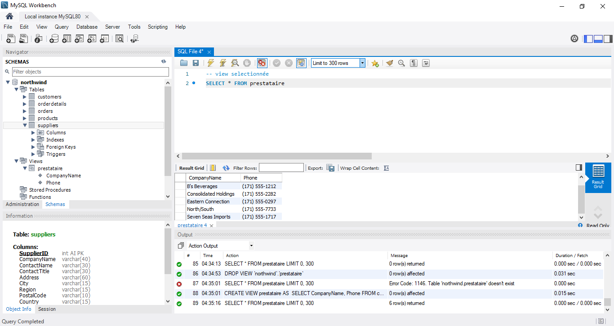
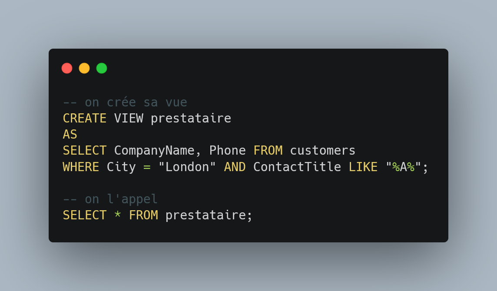

# Part SQL

Réaliser avec [MySQL Workbench](https://www.mysql.com/fr/products/standard/)  
Images via Paint  
Snippet via [Carbon](https://carbon.now.sh/)  

> > View

### Bref présentation et blabla : 

Pour réaliser cette partie j'ai utiliser les data fournis par northwind, data plus volumineuses permettant donc plus de manipulation et meilleurs apprentissage sur MySql. Contrairement à Wamp, HeidiSQL ou autre, MySql ne fournit pas par défaut PhpMyAdmin, il utilise l'équivalent d'un ssms (Sql Server Management Studio) d'Azure, c'est à dire qu'aucune table n'est afficher par défaut, Le serveur, les databases et l'interface de management sont des packages séparée mais accessible via le workbench. Histoire de ne pas trop s' y perdre si dessous ce à quoi ressemble l'interface du Workbench.

Ce système permet également de générée des Schémas, de mappé les bases de données en fonction du rôle de chaque users (a part mappé en dbo peu d'importance), il propose notamment différents engine telle que memory pour les recherches fulltext, l'étrange blackhole qui ne stock aucune donnée ou encore la fameuse archive, engine ne pouvant être réécrite. À l'inverse des produits Azure, il permet une connexion hors credential (grossomodo une co indépendante de la machine).

_____

### Les views

Les vues permettes de rassemblé différent champs de différentes tables par exemple, cela permet de centraliser des donnée particulière et de ne plus à avoir à les rechercher ou re écrire. Les Vues sont indépendantes des tables, elle n'ont pas de restriction avec ces dernières pour être modifier, vous pouvez éditée une vue sans passer par une table quelconque aux préalables, toutefois si les données de la vue change, celle de la table également. Scindée différent champs de la sorte permet aussi de brouiller le chemin originelle de la database. ce n'est plus table_users.id_user mais view.id_user.  

On obtient : 

| CompanyName           |     Phone      |
| --------------------- | :------------: |
| Around the Horn       | (171) 555-7788 |
| B's Beverages         | (171) 555-1212 |
| Consolidated Holdings | (171) 555-2282 |
| Eastern Connection    | (171) 555-0297 |
| North/South           | (171) 555-7733 |
| Seven Seas Imports    | (171) 555-1717 |

(En cours)